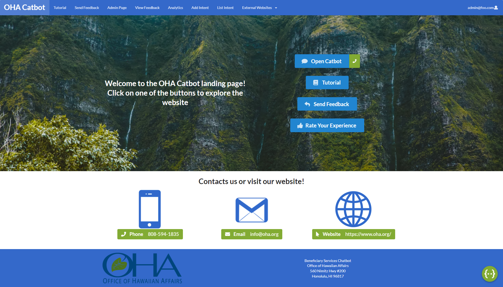
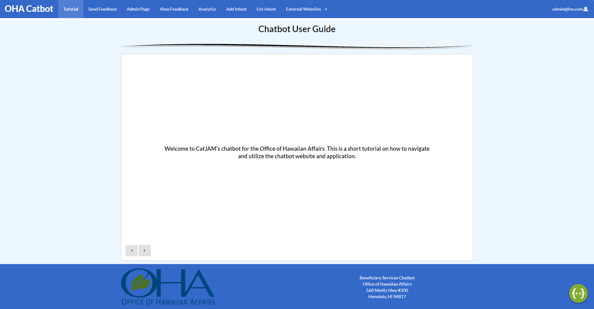
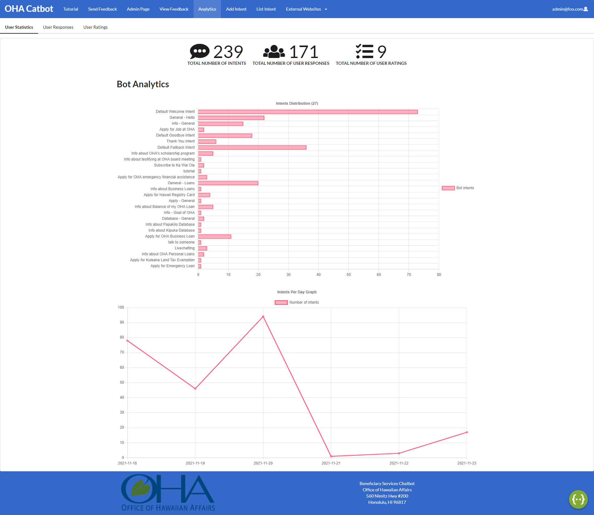
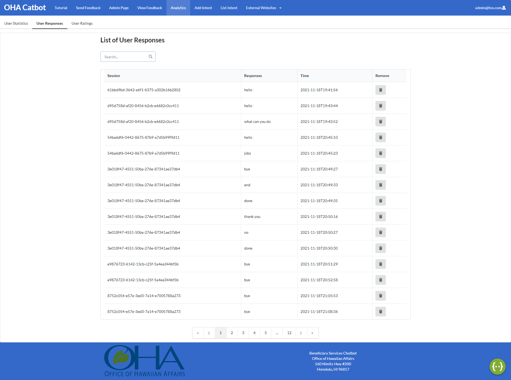
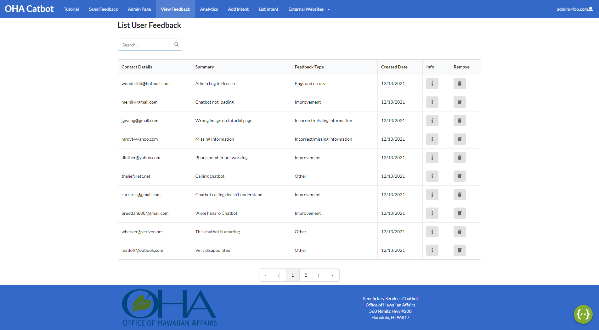
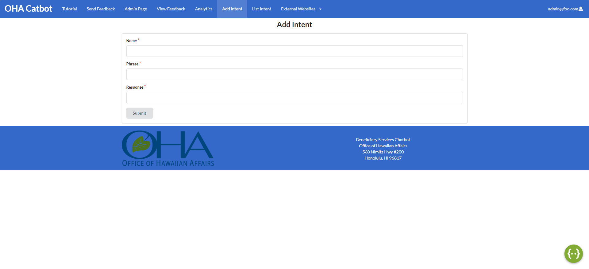

View this project on Github at [Catbot](https://github.com/catjams/catbot)

## Table of Contents
* [Overview](#overview)
* [User Guide](#user-guide)
* [Community Feedback](#community-feedback)
* [Developer Guide](#developer-guide)
* [Deployment](#deployment)
* [Development History](#development-history)
* [Team](#team)

## Overview

Team Catjams have been working on a project for HACC 2021, specifically, a chatbot for The Office of Hawaiian Affairs (OHA). The purpose of this chatbot is to reduce the number of calls OHA receives for information and applications. By providing an easy to access medium through which these questions can be answered, there will be less total calls to OHA, reducing the amount of resources needed. 
  
## User Guide

There are two different users for our website, basic users and admin users. The Landing page for the basic users is the chatbot while the admin users default page is Chatbot Statistics. 

### All Users
 
 * ### [Landing page](https://catbot.bar/#/): 
 The main page everyone will start on is the chatbot page. This page displays the Dialogflow chatbot, a google api we are utilizing for this project. It 	also provides links and contact information for the Office of Hawaiian Affairs. 
 * ### [Tutorial Page](https://catbot.bar/#/tutor): 
 This page provides a short tutorial on how to use the chatbot. 
 * ### [Send Feedback Page](https://catbot.bar/#/sendfeedback): 
 Users who have feedback on the chatbot or website can submit their thoughts through the Send Feedback Page.
 
### Admin Users 

 * ### [Login page](https://catbot.bar/#/signin): 
 Admin will use this page to login with their credentials.
 * ### [Chatbot Analytics](https://catbot.bar/#/analytics): 
 This page will have three different catergories: Chatbot Statistics, Chatbot Effectiveness, and Satisfaction Rates.
  User's Statistics: page shows frequency of intents in a graph format.
  User's Responses: shows a list of user responses.
  User Ratings: Shows a group of cards about user ratings.
 * ### [View Feedback](https://catbot.bar/#/viewfeedbacks):
 This page allows the admin users to view any feedback the users had and allow modification.
 * ### [Add Intent](https://catbot.bar/#/addintent): 
 Admin users that want to add a new intent can submit one through this page 
 * ### [List Intent](https://catbot.bar/#/listintent): 
 Shows admin user’s a list of all intents.
 * ### [Edit Intent](https://catbot.bar/#/listintent):
 Allows the admin to edit all of the intents.
 
## Community Feedback

### Morresh
* Thinks the website looks nice and the chatbot does what it needs to do
* Found a question that the chatbot responds to in weird ways
* Send feedback page has a lot of empty space. Maybe add something to it

### Dylan
* Likes that the chatbot gives links and options when asked certain questions
* The website does what it sets out to do
* Add a darkmode or slightly darker colors to the pages
* Make the footer sticky to the bottom of the page
* Make the images on the tutorial page slightly bigger. Hard to read on large screens

### Evelien
* Would like a description of what the website/catbot is for!
* Homepage and Admin pages are nicely done
* Tutorial page uses words Catbot and Chatbot interchangeably. Stick to one of the other to make it less confusing
* Chatbot gives funny responses. Limited in recognizing input, but gives good answers for the questions it can recognize

### Andreas
* The site looks great and is easily accessible, exactly what you're looking for on a chat bot side
* Chatbot is friendly and has accurate links and information
* Everything is easy to find and in a logical location
* The chatbot has a few weird responses to certain questions

### Jacob
* Website looks nice and everything works well
* The chatbot gives good responses. Likes that the chatbot can detect questions that are written in an odd way as well
* Footer should be attached to the bottom of the page. It looks weird on smaller pages.
  
## Developer Guide

1. Download [Node.js](https://nodejs.org/en/)
2. Download [Meteor](https://www.meteor.com/)
3. Visit the catbot github page and download .zip or open the project with Github Desktop
4. Once you got the repo downloded on your computer you then cd into the app /app directory and install libaries with:
```
$ meteor npm install
```
5. Once the installation is done, you run the program with
```
$ meteor npm run start
```

## Deployment
View the application here: [OHA Catbot](https://catbot.bar/#/)

## Development History

### [Milestone 1](https://github.com/catjams/catbot/projects/1): Create a working prototype, and integrate chatbot 
### [Milestone 2](https://github.com/catjams/catbot/projects/2): Implement analytics and improve overall user interface
### [Milestone 3](https://github.com/catjams/catbot/projects/3): Finalize application 

## Team

Catbot application is designed, implemented, and maintained by [Braydon Nagasako](https://breadonn.github.io/), [Wenhao Qiu](https://wenhaoq20.github.io/), [Zolbo Tomita](https://tomitaz.github.io/).

