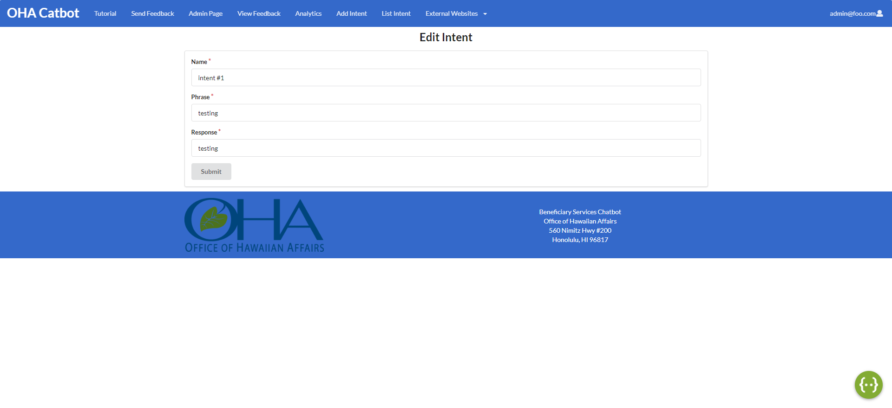

View this project on Github at [Catbot](https://github.com/catjams/catbot)

## Table of Contents
* [Overview](#overview)
* [User Guide](#user-guide)
* [Developer Guide](#developer-guide)
* [Deployment](#deployment)
* [Development History](#development-history)
* [Team](#team)

## Overview

Team Catjams have been working on a project for HACC 2021, specifically, a chatbot for The Office of Hawaiian Affairs (OHA). The purpose of this chatbot is to reduce the number of calls OHA receives for information and applications. By providing an easy to access medium through which these questions can be answered, there will be less total calls to OHA, reducing the amount of resources needed. 
  
## User Guide

There are two different users for our website, basic users and admin users. The Landing page for the basic users is the chatbot while the admin users default page is Chatbot Statistics. 

### All Users
 
 * ### [Chatbot page](https://catbot.bar/#/): 
 The main page everyone will start on is the chatbot page. This page displays the Dialogflow chatbot, a google api we are utilizing for this project. It 	also provides links and contact information for the Office of Hawaiian Affairs. 
 * ### [Tutorial Page](https://catbot.bar/#/tutor): 
 This page provides a short tutorial on how to use the chatbot.
 * ### [Send Feedback Page](https://catbot.bar/#/sendfeedback): 
 Users who have feedback on the chatbot or website can submit their thoughts through the Send Feedback Page.
 
### Admin Users 

 * ### [Login page](https://catbot.bar/#/signin): 
 Admin will use this page to login with their credentials.
 * ### [Chatbot Statistics](https://catbot.bar/#/analytics): 
 This page shows the amount of visitors and chat interaction in a graph format.
 * ### Chatbot Effectiveness: 
 The user is prompted with a graph showing if users received the information they were looking for.
 * ### Satisfaction Rates: 
 Shows admin users a graph of the satisfaction rate of all chatbot users.
 * ### [Add Intent](https://catbot.bar/#/addintent): 
 Admin users that want to add a new intent can submit one through this page 
 * ### [List Intent](https://catbot.bar/#/listintent): 
 Shows admin user’s a list of all intents.
 * ### [Edit Intent](https://catbot.bar/#/listintent):
 Allows the admin to edit all of the intents.
  
## Developer Guide

1. Download [Node.js](https://nodejs.org/en/)
2. Download [Meteor](https://www.meteor.com/)
3. Visit the catbot github page and download .zip or open the project with Github Desktop
4. Once you got the repo downloded on your computer you then cd into the app /app directory and install libaries with:
```
$ meteor npm install
```
5. Once the installation is done, you run the program with
```
$ meteor npm run start
```

## Deployment
View the application here: [OHA Catbot](https://catbot.bar/#/)

## Development History

### [Milestone 1](https://github.com/catjams/catbot/projects/1): Create a working prototype 
### Milestone 2: Optimize and fully integrate a chatbot using Dialog Flow
### Milestone 3: Finalize application 

## Team

Catbot application is designed, implemented, and maintained by [Braydon Nagasako](https://breadonn.github.io/), [Wenhao Qiu](https://wenhaoq20.github.io/), [Zolbo Tomita](https://tomitaz.github.io/).

